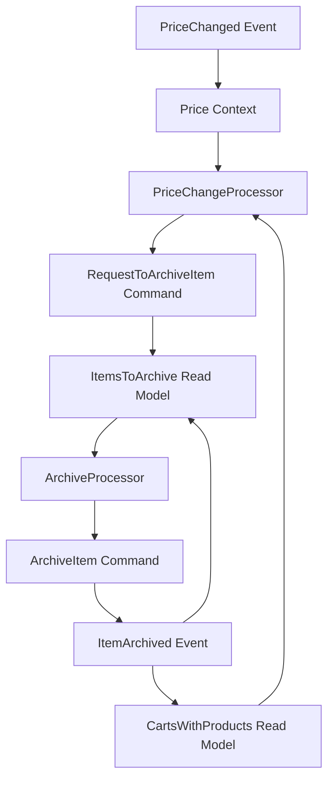

# Research: Price Change TODO List & Automation

**Feature**: 014-price-change-automation  
**Date**: 2025-12-01  
**Status**: Complete

## Research Topics & Decisions

### 1. Processor Pattern Decision

**Decision**: GenServer subscription to `"stream_type:price"` PubSub topic

**Rationale**:
- Matches existing EventStore subscription pattern (symmetric with how read models work)
- Simple to implement with minimal complexity
- Built-in idempotency: events are durable in EventStore, processor can crash/restart without losing data
- Easy to resume: on restart, re-read TODO list stream and process remaining items
- No external dependencies needed (gen_stage not required)

**Alternatives Considered**:

| Alternative | Why Rejected |
|-------------|--------------|
| PubSub handler tasks | Not durable - if app crashes during processing, work lost; no easy resume |
| gen_stage | Overkill for current throughput (<100 concurrent carts); requires external dependency |
| Database polling | Less reactive; doesn't match event-sourced architecture |

**Implementation Pattern**:
```elixir
defmodule Epoch.Automation.PriceChangeProcessor do
  use GenServer
  
  def start_link(opts) do
    GenServer.start_link(__MODULE__, opts, name: __MODULE__)
  end
  
  def init(_opts) do
    # Subscribe to price stream type on init
    Phoenix.PubSub.subscribe(Epoch.PubSub, "stream_type:price")
    {:ok, %{}}
  end
  
  def handle_info({:events_appended, _stream, events}, state) do
    # Process each PriceChanged event
    Enum.each(events, &process_event/1)
    {:noreply, state}
  end
  
  defp process_event(%{event: %PriceChanged{product_id: product_id}}) do
    # Find affected carts, emit archive requests
  end
end
```

**Idempotency Strategy**:
- Check if ItemArchiveRequested already exists for item_id before emitting
- Use EventStore stream read to detect duplicates
- Processor can safely re-process events on restart

**Resume Strategy**:
1. On restart, processor starts fresh (no state needed in GenServer)
2. TODO list read model persists pending items in event stream
3. Archive processor reads TODO list and continues processing pending items

---

### 2. External Event Translation Pattern

**Decision**: Single `PriceChanged` event type (external = internal) with `Epoch.Backoffice.Price` context

**Rationale**:
- Matches existing `InventoryUpdated` pattern - simpler than separate external/internal types
- UI publishes directly to EventStore (no separate translator module needed)
- Avoids redundant event duplication
- Easier to audit - single event type visible in all streams

**Alternatives Considered**:

| Alternative | Why Rejected |
|-------------|--------------|
| Separate External/Internal events | Unnecessary complexity; InventoryUpdated doesn't use this pattern |
| Translator module | Not needed when event type is the same; command handler serves this role |
| Direct event publish without command | Loses validation; command handler provides product validation |

**Where Translator Logic Lives**:
- In `Epoch.Backoffice.Price.change_price/1` function (command handler)
- Validates product exists via Catalog
- Retrieves current price for `old_price` field
- Emits `PriceChanged` event to `"price-{product_id}"` stream

**Stream Naming**:
- Format: `"price-{product_id}"` (consistent with `"inventory-{product_id}"`)
- Stream type: `"price"` for PubSub topic filtering

---

### 3. TODO List Read Model Pattern

**Decision**: Event-sourced read model in separate `"cart-{cart_id}"` stream (items tracked per cart)

**Rationale**:
- Events already appended to cart streams; no separate TODO stream needed
- ItemArchiveRequested and ItemArchived events appended to respective cart streams
- Read model built by scanning cart streams for pending items
- Natural durability via EventStore
- Matches existing pattern where cart events live in cart streams

**Alternatives Considered**:

| Alternative | Why Rejected |
|-------------|--------------|
| Separate "todo:items_to_archive" stream | Adds complexity; breaks encapsulation of cart stream |
| Database table | Doesn't match event-sourced architecture; adds external state |
| In-memory cache | Not durable; lost on restart |

**Read Model Structure**:
```elixir
@type todo_item :: %{
  cart_id: String.t(),
  product_id: String.t(),
  item_id: String.t(),
  requested_at: DateTime.t()
}

@type state :: %{
  pending: [todo_item()]
}
```

**Event Evolution**:
- `ItemArchiveRequested` → Add item to pending list
- `ItemArchived` → Remove item from pending list
- Ignore unknown events

**Query Pattern for Processor**:
```elixir
# Build TODO list by scanning all cart streams
def get_pending_items do
  {:ok, %{events: all_events}} = EventStore.read_by_stream_type("cart")
  
  all_events
  |> Enum.map(& &1.event)
  |> ItemsToArchive.project()
  |> ItemsToArchive.all_pending()
end
```

---

### 4. Carts with Products Read Model

**Decision**: Global read model built from all cart streams, queried by product_id

**Rationale**:
- Price change processor needs "all carts containing product X"
- Global model avoids O(n) scan of individual cart streams
- Built from `read_by_stream_type("cart")` to gather all cart events
- Updated reactively via PubSub subscription

**Alternatives Considered**:

| Alternative | Why Rejected |
|-------------|--------------|
| Per-cart model | Inefficient for "find all carts with product X" query |
| Database materialized view | Doesn't match event-sourced architecture |
| Reverse index only | Harder to maintain; read model handles naturally |

**Read Model Structure**:
```elixir
@type mapping :: %{
  cart_id: String.t(),
  product_id: String.t(),
  item_id: String.t()
}

@type state :: %{
  mappings: [mapping()]
}
```

**Event Evolution**:
- `ItemAdded` → Add mapping (cart_id, product_id, item_id)
- `ItemRemoved` → Remove mapping by item_id
- `ItemArchived` → Remove mapping by item_id
- `CartCleared` → Remove all mappings for cart_id

**Query Pattern**:
```elixir
def carts_with_product(state, product_id) do
  state.mappings
  |> Enum.filter(&(&1.product_id == product_id))
  |> Enum.map(& &1.cart_id)
  |> Enum.uniq()
end
```

**Cart ID Resolution**:
- Add explicit `cart_id` field to `ItemAdded`, `ItemRemoved`, `ItemArchived` events
- Currently implicit in stream name; making explicit simplifies read model
- Matches `ItemArchiveRequested` pattern from spec (includes `cart_id`)

---

## Implementation Dependencies



**Implementation Sequence**:
1. `PriceChanged` event definition
2. `Price` context with `change_price/1` command
3. `CartsWithProducts` read model
4. `ItemsToArchive` read model
5. `ItemArchiveRequested` event definition
6. `PriceChangeProcessor` automation (depends on 3, 4)
7. `RequestToArchiveItem` command handler
8. `ArchiveItem` command handler
9. Wire up processors in Application supervision tree

---

## Key Technical Decisions Summary

| Decision | Choice | Key Rationale |
|----------|--------|---------------|
| Processor pattern | GenServer + PubSub | Matches existing patterns; durable; simple |
| Event type | Single PriceChanged | Matches InventoryUpdated; no translator needed |
| TODO list storage | Cart stream events | Natural fit; no separate stream complexity |
| Carts read model | Global projection | Efficient product→carts query |
| Cart ID in events | Explicit field | Simplifies read model; matches spec |
| Idempotency | Check before emit | Handles restart safely |

---

## Open Questions (Resolved)

| Question | Resolution |
|----------|------------|
| Should external PriceChanged be separate type? | No - single type like InventoryUpdated |
| Where does translator logic live? | In Price.change_price/1 command handler |
| How to handle processor restart? | TODO list persists; processor re-reads pending |
| How to query affected carts efficiently? | Global CartsWithProducts read model |
| Should TODO list have separate stream? | No - use cart streams for ItemArchiveRequested |
